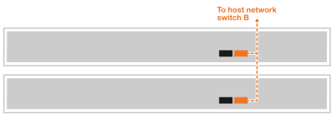

= Conecte seus servidores de terceiros ao AI Data Engine
:allow-uri-read: 
:icons: font
:imagesdir: ../media/

[role="lead"]
Conecte seus servidores de terceiro à rede do host e aos switches de rede do cluster para habilitar o processamento de cargas de trabalho de IA e a integração com seu sistema de storage AFX 1K. Este procedimento utiliza conexões tanto para acesso à rede do host quanto para comunicação com o cluster, permitindo que os nós aproveitem a infraestrutura de cluster existente sem precisar desligar o sistema AFX.

.Sobre esta tarefa
Esses procedimentos mostram configurações comuns. O cabeamento específico depende dos componentes compatíveis com seu sistema de storage. Para obter detalhes completos sobre a configuração, consulte a documentação do servidor de terceiro.

.Antes de começar
* Você já possui um sistema de storage AFX 1K instalado. Para obter informações sobre a instalação do sistema de storage AFX 1K, consulte link:https://docs.netapp.com/us-en/ontap-afx/install-setup/install-setup-workflow.html["Documentação de instalação do sistema de storage AFX 1K"^].
* Você já instalou e configurou os switches de rede necessários. Entre em contato com o administrador de rede para obter informações sobre como conectar o sistema aos switches de rede.
* Você já analisou os requisitos de cabeamento para seus servidores de terceiros. Para obter informações sobre a configuração de cabeamento, consulte a documentação do servidor de terceiros.

NOTE: São necessários três servidores de terceiro para implantações do AI Data Engine software.

== Etapa 1: Conecte os servidores de terceiros à rede do host

Para servidores de terceiros, conecte-se à sua rede host.

.Passos
. Conecte as portas de rede 'b' 100GbE dos servidores de terceiros ao switch de rede Ethernet A usando os cabos apropriados com base nas placas de interface de rede (NICs) do seu servidor e nos tipos de porta do switch.
+
Por exemplo:

+
** Servidor de terceiro 1, porta 'e4b'
** Servidor de terceiro 2, porta 'e4b'
+
*Cabos 100GbE*

+
image::../media/oie_cable100_gbe_qsfp28.png[Cabo Ethernet de 100 Gb]

+
image::../media/drw_aide_server_host_a_ieops-2831.svg[Cabo para rede Ethernet]

. Conecte as portas de rede 'b' 100GbE dos servidores de terceiros ao switch de rede Ethernet B usando os cabos apropriados, de acordo com as placas de interface de rede (NICs) do seu servidor e os tipos de porta do switch. Por exemplo:
+
** Servidor de terceiro 1, porta 'e5b'
** Servidor de terceiro 2, porta 'e5b'
+
*Cabos 100GbE*

+
image::../media/oie_cable100_gbe_qsfp28.png[Cabo Ethernet de 100 Gb]

+

NOTE: Consulte a documentação do seu servidor de terceiro para obter informações específicas sobre configurações de porta e tipos de cabo.

== Passo 2: Conecte os cabos do cluster

Para servidores de terceiros, conecte os cabos das conexões do cluster.

.Passos
. Conecte as portas de rede do cluster 'a' 100GbE nos servidores de terceiros ao switch de rede do cluster A usando os cabos apropriados com base nas placas de interface de rede (NICs) dos servidores de terceiros e nos tipos de porta do switch.
+
Por exemplo:

+
** Servidor de terceiro 1, porta 'e4a'
** Servidor de terceiro 2, porta 'e4a'
+
*Cabos 100GbE*

+
image::../media/oie_cable100_gbe_qsfp28.png[Cabo Ethernet de 100 Gb]

+
image::../media/drw_aide_server_cluster_a_ieops-2833.svg[Cabo para rede Ethernet]

. Conecte as portas de rede do cluster 'a' 100GbE nos servidores de terceiros ao switch de rede do cluster B usando os cabos apropriados com base nas placas de interface de rede (NICs) do seu servidor e nos tipos de porta do switch.
+
Por exemplo:

+
** Servidor de terceiro 1, porta 'e5a'
** Servidor de terceiro 2, porta 'e5a'
+
*Cabos 100GbE*

+
image::../media/oie_cable100_gbe_qsfp28.png[Cabo Ethernet de 100 Gb]

+
image::../media/drw_aide_server_cluster_cabling_b_ieops-2834.svg[Cabo para rede Ethernet]

NOTE: Consulte a documentação do seu servidor de terceiro para obter informações específicas sobre configurações de porta e tipos de cabo.

.Qual é o próximo passo?
Depois de conectar os cabos do hardware, link:power-on-hardware.html["Ligue seus servidores de terceiros"].
